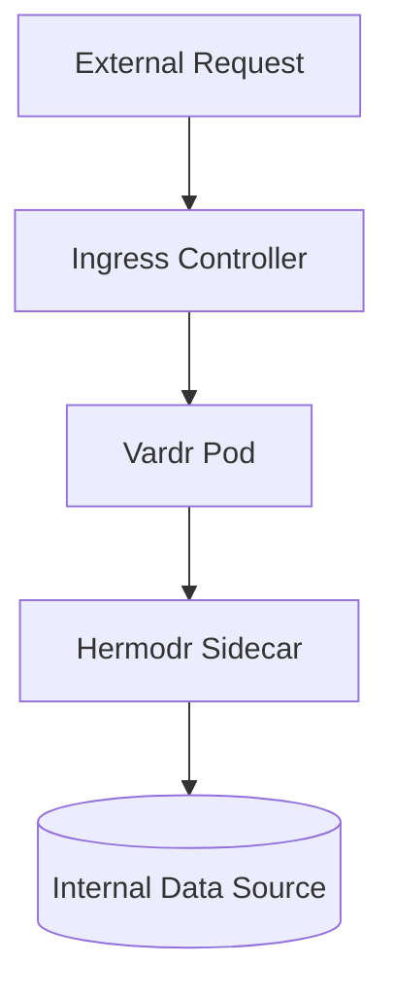

# Vardr — Asgard User Manual

## System Overview
Observability and Metrics Gateway. Hooks into Kube-State and Prometheus metrics visualizing traffic via its dashboard.

This repository is an integral node of the **Asgard AI Ecosystem**. It operates securely inside the native K3s cluster.

## Architecture


## Setup & Deployment
To deploy Vardr natively within the K3s environment, navigate to the Asgard root and execute:
```bash
./scripts/k3s-deploy.sh vardr
```
*Note: In SIT/Local iterations, this service resolves internally at `vardr.asgard.internal` via local `/etc/hosts` DNS configuration.*

## MCP Integration Strategy (Read-only Boundary)
In alignment with platform security parameters, the MCP toolsets exposed by Vardr through the Hermodr sidecar are explicitly restricted to **GET**, **LIST**, and **CHECK** capabilities. 

All transaction-mutating tools (POST/PUT/DELETE) remain structurally disabled at the MCP edge tier to ensure agent immutability during preliminary cluster staging.

## Interface & Usage Flow
*Visual guides and interface demonstrations (where applicable) are appended beneath this line.*


