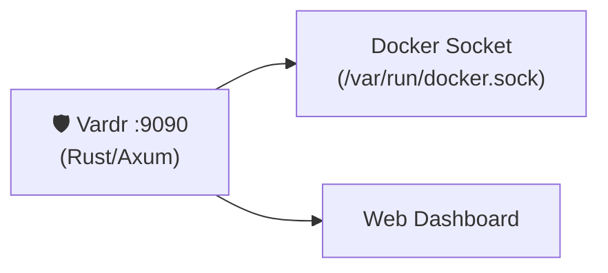

# SI-01: Software Implementation Report — Vardr

**Product:** 🛡️ Vardr (Monitoring Dashboard)
**Document ID:** SI-RPT-VARDR-001
**Version:** 0.1.0
**Date:** 2026-03-18
**Standard:** ISO/IEC 29110 — SI Process
**Stack:** 🦀 Rust (Axum)

---

## 1. Product Overview

| Field | Value |
|:--|:--|
| **Repository** | MegaWiz-Dev-Team/Vardr |
| **Port** | `:9090` |
| **Container** | `asgard_vardr` |
| **Dependencies** | Docker socket (read-only) |

---

## 2. Architecture

## 3. Functional Requirements

| FR | Description | Status |
|:--|:--|:--|
| FR-V01 | Docker container health monitoring | ✅ Done |
| FR-V02 | Service status dashboard | ✅ Done |
| FR-V03 | Resource usage metrics | ✅ Done |
| FR-V04 | Agent activity monitoring | 📋 Planned |

## 4. API Endpoints

| Method | Path | Description |
|:--|:--|:--|
| `GET` | `/health` | Health check |
| `GET` | `/api/services` | List container statuses |
| `GET` | `/api/metrics` | Resource usage metrics |

## 5. Configuration

| Variable | Default | Description |
|:--|:--|:--|
| `VARDR_PORT` | `9090` | Port |
| Docker socket mount | `/var/run/docker.sock` | Container monitoring |

---

*บันทึกโดย: AI Assistant (ISO/IEC 29110 SI Process)*
*Created: 2026-03-18 by Antigravity*
